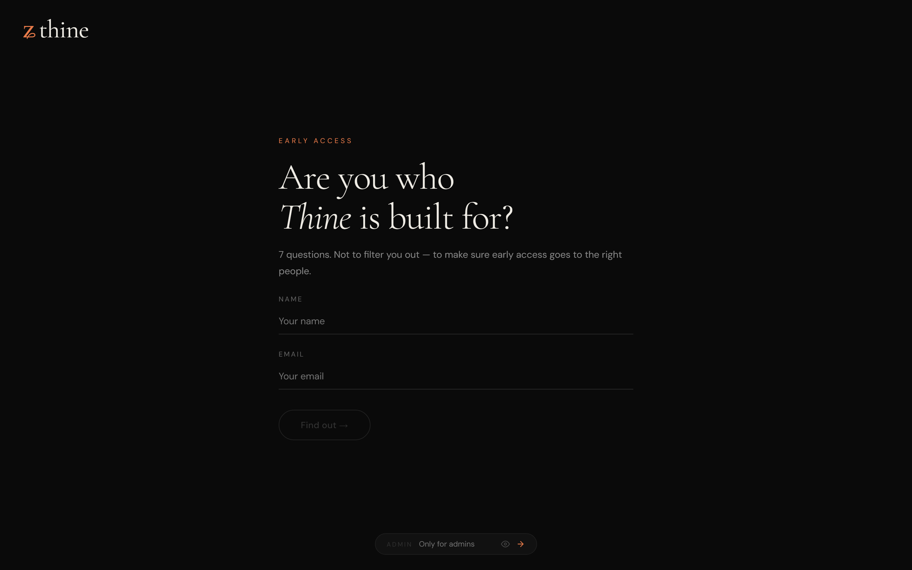
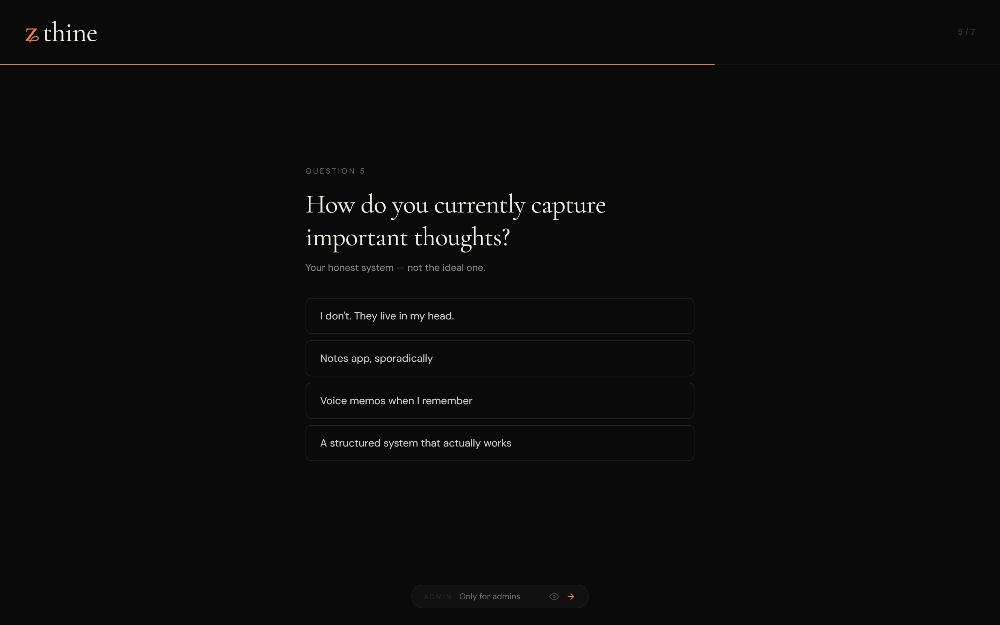
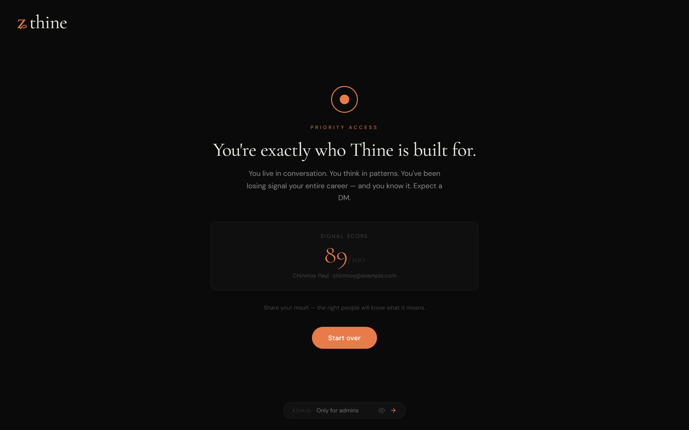
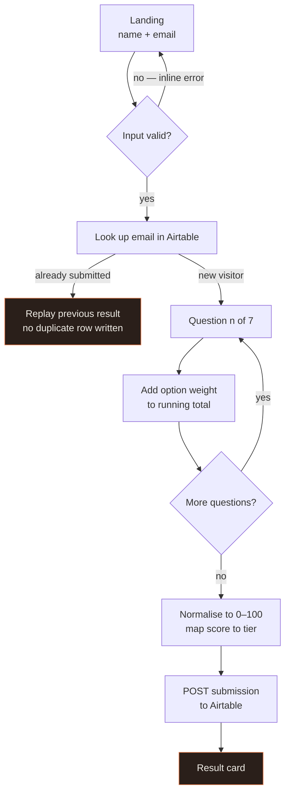
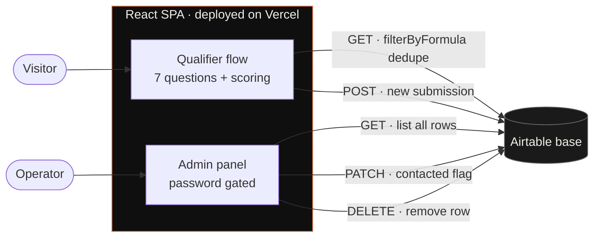
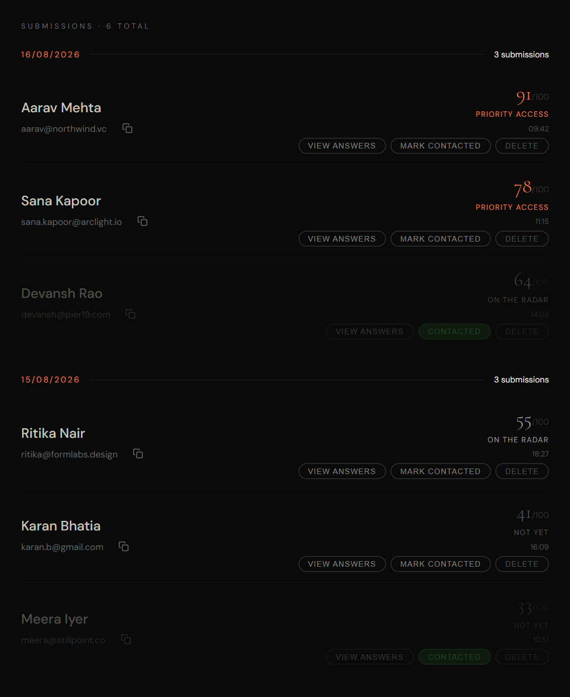
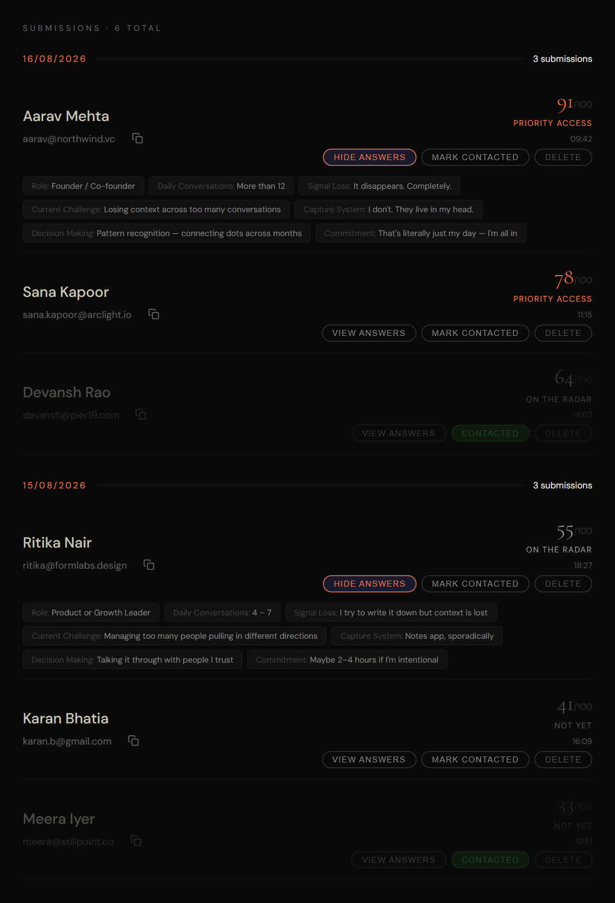
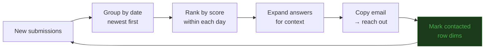
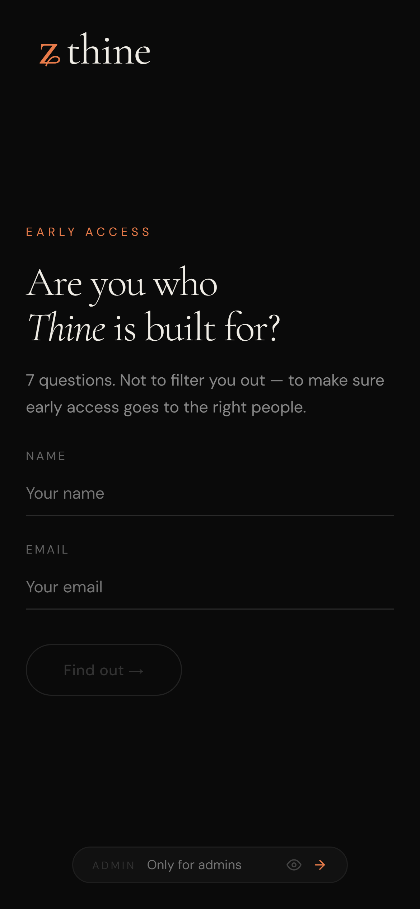
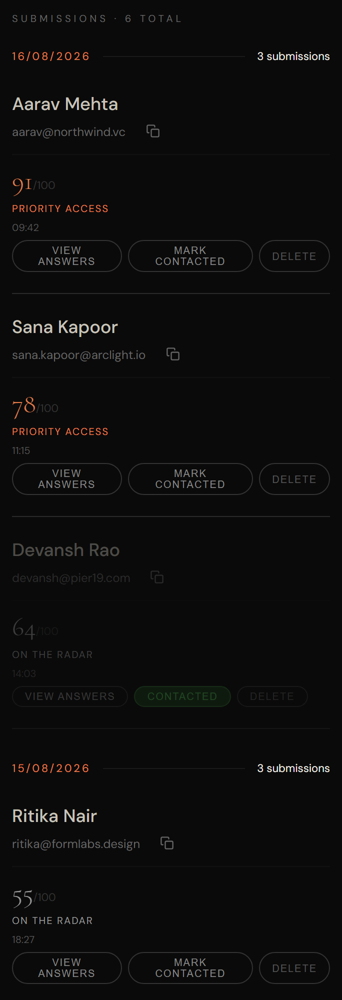

<div align="center">

# Thine Qualifier

**A 7-question qualifier that scores every signup, tiers them, and hands the operator a ranked pipeline instead of a flat list of emails.**

Built for [Thine](https://thine.com) — a personal intelligence app — to decide who gets early access.

[](https://react.dev)
[](https://vite.dev)
[](https://airtable.com)
[](https://vercel.com)

**[→ Live demo](https://thine-qualifier.vercel.app)**


</div>

---

## The idea

A normal waitlist gives you a pile of emails and no way to tell a founder who lives in back-to-back calls from a student who clicked out of curiosity. Both look identical in a spreadsheet.

This replaces the email box with a scored funnel. Seven questions, every answer carries a weight, and the total sorts each person into one of three tiers. Behind a password, the operator gets those submissions grouped by day and ranked by score — so the first outreach of the morning is the highest-signal person who signed up yesterday, not whoever happened to be at the top of the sheet.

<table>
<tr>
<td width="50%"></td>
<td width="50%"></td>
</tr>
<tr>
<td align="center"><em>Entry — validated before anything is written</em></td>
<td align="center"><em>One question per screen, progress up top</em></td>
</tr>
</table>

---

## How the scoring works

Seven questions, four options each. Every option carries a weight and each question tops out at **30**, so the ceiling is **210**. The raw total is normalised to a 0–100 "signal score", and that percentage picks the tier.

| Tier | Band | What it means |
|:--|:--|:--|
| **Priority Access** | ≥ 72 | Reach out today |
| **On the Radar** | 48 – 71 | Real fit, wrong moment — revisit next cohort |
| **Not Yet** | ≤ 47 | Wrong stage entirely |

The part worth explaining is that **two questions score backwards on purpose.**

Asked how they capture important thoughts, *"I don't. They live in my head."* scores **30** — while *"A structured system that actually works"* scores **5**. Same inversion on what happens to an important insight: *"It disappears. Completely."* scores **30**, *"I have a system"* scores **5**.

That isn't a bug in the weights. Someone who has already solved the problem has nothing to buy. The score is measuring **unmet pain**, not sophistication — so the people who feel the problem most acutely float to the top, and the ones who've already built their own workaround sink. The commitment question at the end works as the counterweight: it asks for 12 hours of daily use during early access, and answering *"that sounds like a lot"* is worth **2 points**, which is usually enough to pull an otherwise strong profile out of Priority Access.

<div align="center">

<br/><em>Result card — tier, headline, and the normalised signal score</em>
</div>

---

## User flow



Two details in there that took the most iteration:

- **Duplicate prevention.** Before the first question renders, the entered email is looked up with an Airtable `filterByFormula` query. If it already exists, the app skips the funnel entirely and replays that person's original score. Retaking can't inflate your way into Priority Access.
- **Validation before write.** Name must be 3+ characters with no digits, email has to pass a shape check. Both fail inline, before any network call — junk rows never reach the base.

---

## Architecture

No backend service. The React SPA talks to Airtable's REST API directly, and Airtable acts as database, admin-editable store, and export layer at once.



The tradeoff this buys and what it costs is written up in [Tradeoffs](#tradeoffs) below.

---

## Admin dashboard

> **Try it:** open the [live demo](https://thine-qualifier.vercel.app), scroll to the `ADMIN` box pinned at the bottom of any screen, and enter **`thine2026`**.

Submissions come back grouped by date — newest day first — and ranked by score *within* each day. Getting that right took a couple of passes: Airtable stores the timestamp as a `DD/MM/YYYY, HH:MM` string, and comparing those as strings compares the *day* field first — so `31/08` sorts above `01/09`, pushing an older day to the top of the list every time a month rolls over. The fix parses each group key back into a real `Date` before comparing.

<div align="center">

</div>

Each row carries the actions an operator actually needs during outreach:

| Action | Behaviour |
|:--|:--|
| **View answers** | Expands all 7 responses inline as chips — context before you write the email |
| **Copy email** | One click to clipboard, button flips to a green tick for 1.5s |
| **Mark contacted** | Updates instantly and dims the row, then persists to Airtable in the background |
| **Delete** | Removes the row from the base after a confirm — for spam and test entries |
| **Show / hide password** | Eye toggle on the login, plus Enter-key submit |

<div align="center">

<br/><em>Expanded rows — every answer visible without leaving the list. Dimmed rows are already contacted.</em>
</div>

The contacted toggle is optimistic: React state flips the moment you click, and the `PATCH` fires afterwards. On a spotty connection the operator never waits on a spinner mid-triage.



---

## Mobile

The dashboard was the hard part — a six-column table doesn't survive a 390px viewport. Below 600px each row breaks into a stacked card with the score block moved under the contact details and its own divider, so the ranking is still readable while thumb-scrolling.

<table>
<tr>
<td width="50%" align="center"></td>
<td width="50%" align="center"></td>
</tr>
<tr>
<td align="center"><em>Qualifier</em></td>
<td align="center"><em>Dashboard, stacked</em></td>
</tr>
</table>

---

## Tech stack

| | |
|:--|:--|
| **Frontend** | React 18, single-component SPA with inline style objects |
| **Build** | Vite 5 |
| **Backend** | Airtable REST API — no server of my own |
| **Hosting** | Vercel |
| **Linting** | ESLint 9 flat config |

Fonts are Cormorant Garamond for display and DM Sans for UI, on a near-black `#0a0a0a` ground with a single `#E87B4A` accent carrying every interactive and scoring state.

---

## Running locally

```bash
git clone https://github.com/chinmoypaul8897/thine-qualifier.git
cd thine-qualifier
npm install
```

Create a `.env` in the project root:

```env
VITE_AIRTABLE_BASE_ID=appXXXXXXXXXXXXXX
VITE_AIRTABLE_TABLE_ID=tblXXXXXXXXXXXXXX
VITE_AIRTABLE_API_KEY=patXXXXXXXXXXXXXX
```

```bash
npm run dev      # dev server
npm run build    # production build
npm run lint     # eslint
```

The qualifier renders and scores without valid credentials — Airtable calls fail closed and the flow carries on. Persistence and the admin list need a real base.

### Airtable schema

| Field | Type | Written by |
|:--|:--|:--|
| `Name` | Single line text | Qualifier |
| `Email` | Email | Qualifier |
| `Score` | Number | Qualifier — normalised 0–100 |
| `Tier` | Single line text | Qualifier |
| `Time` | Single line text | Qualifier — `DD/MM/YYYY, HH:MM` |
| `Role` | Single line text | Answer 1 |
| `Daily Conversations` | Single line text | Answer 2 |
| `Signal Loss` | Single line text | Answer 3 |
| `Current Challenge` | Single line text | Answer 4 |
| `Capture System` | Single line text | Answer 5 |
| `Decision Making` | Single line text | Answer 6 |
| `Commitment` | Single line text | Answer 7 |
| `Contacted` | Checkbox | Admin panel |

---

## Tradeoffs

Worth being direct about what a serverless-in-the-loosest-sense architecture costs, because the shortcuts here are deliberate and I'd build it differently for anything handling real volume.

**The Airtable key ships to the browser.** Vite inlines every `VITE_`-prefixed variable into the client bundle at build time, so the credential is readable by anyone who opens devtools on the deployed site. It bought a working product with zero backend, which was the right call for a validation build — but it means the key holds whatever permissions the base grants, to everybody. The fix is a thin serverless function on Vercel that proxies Airtable and keeps the token server-side.

**The admin gate is a hardcoded string.** `thine2026` is compared client-side in [`src/App.jsx`](src/App.jsx), which makes it a speed bump rather than authentication — it keeps a curious visitor out of the dashboard and nothing more. Real auth belongs behind that same serverless layer, session-based, with the submission list never reaching an unauthenticated client. It's published openly in this README precisely because it protects nothing; the demo is meant to be explorable.

**One component, 1,200 lines.** Every screen, all styling, and all four Airtable calls live in a single `App.jsx` with inline style objects. Fine at this size and genuinely fast to iterate on, but the seams are obvious: the questions and weights want to be data, the Airtable calls want a small client module, and the admin panel is its own route.

**The answer options aren't keyboard accessible.** Each of the seven options renders as a `<div>` with an `onClick` handler, and there isn't a single `role`, `tabIndex`, or `aria-*` attribute in the component. So the funnel can't be completed without a mouse, and a screen reader announces seven unlabelled generic containers instead of a question with four choices. Swapping the divs for `<button>` elements fixes both at once, and it's the first change I'd make.

**No test suite.** Scoring and tiering are pure functions of the answer set — `getTier` and the accumulator are the two things most worth pinning down before the weights get tuned again.

---

## Author

**Chinmoy Paul** — Data Science & AI, IIT Guwahati

[GitHub](https://github.com/chinmoypaul8897) · [Live demo](https://thine-qualifier.vercel.app)
